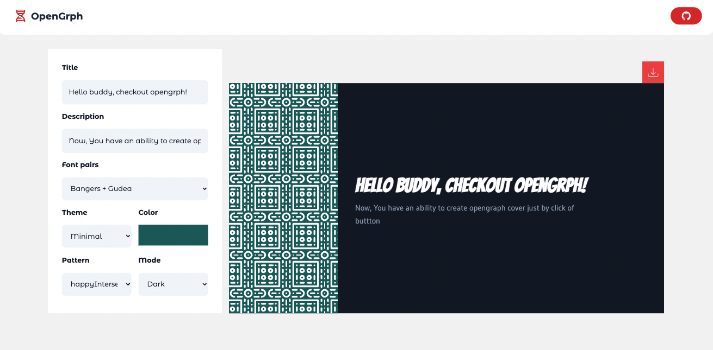

<h1 align="center">
Open<span style="color:#EF476F">Grph</span>
</h1>

<p align="center">Create open graph & cover images just by click of button 🚀</p>



## ⚡ Features

- ❤️ 21 elegant looking font pairs to match your feel
- ✨ 88 background patterns
- 🎖️ 3 themes, 2 modes
- ⚽ draggable elements in canvas
- 📥 download images in `png` format

## ⚒️ Development

```
git clone git@github.com:Grassper/OpenGrph.git

yarn

yarn dev // start local server
```

## 👇 Contribution

Pull requests are welcome.

_For major changes, please open an issue first to discuss what you would like to change._

## 🪪 License

MIT - Vadivazhagan Vadivel 2022

Don't forget to leave a ⭐ if you found this useful
